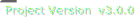

  

<h1 align="center">Game Making Using Pygame Testing</h1>

  
  
  

---

## What is this project?

This project is to see if i can make a full game using pythons pygame. at the moment i have simple games like breakout, tetris and snake but im working on going bigger with better game such as platformers and more.

---

### Updates
 
[Added 4.0.0](./updatelog.md)
 
[Added 3.6.0](./updatelog.md)
 
[Added 3.5.5](./updatelog.md)
 
[Added 3.5.0](./updatelog.md)
 
[Added 3.0.0](./updatelog.md)
 
[Added 2.5.5](./updatelog.md)
 
[Added 2.5.0](./updatelog.md)

---

# Help Section

#### BEFORE OPENING INSTALL PYTHON AND PYGAME
install python from https://www.python.org/downloads/.
then open a command window and type: pip install pygame.
#### if it gives you a error saying "pip is not a recognised command" then:
  1. type in command prompt: curl https://bootstrap.pypa.io/get-pip.py -o get-pip.py, to get pip.py file
  2. then type: python get-pip.py
  3. finally to check if installed type: pip help.
if pip still doesnt work, then look at https://phoenixnap.com/kb/install-pip-windows.

## Other Info
Ill most likely be updating this every week, if you also want to edit the file download VSCode or use IDLE (VSC download:https://code.visualstudio.com/download. download for IDLE: unknown.) ONLY EDIT THE FILE IF YOU KNOW HOW TO CODE IN PYTHON.

<svg height="32" aria-hidden="true" viewBox="0 0 16 16" version="1.1" width="32" data-view-component"true" class="octicon octicon-mark-github v-align-middle">
  <path fill-rule="evenodd" d="M8 0C3.58 0 0 3.58 0 8c0 3.54 2.29 6.53 5.47 7.59.4.07.55-.17.55-.38 0-.19-.01-.82-.01-1.49-2.01.37-2.53-.49-2.69-.94-.09-.23-.48-.94-.82-1.13-.28-.15-.68-.52-.01-.53.63-.01 1.08.58 1.23.82.72 1.21 1.87.87 2.33.66.07-.52.28-.87.51-1.07-1.78-.2-3.64-.89-3.64-3.95 0-.87.31-1.59.82-2.15-.08-.2-.36-1.02.08-2.12 0 0 .67-.21 2.2.82.64-.18 1.32-.27 2-.27.68 0 1.36.09 2 .27 1.53-1.04 2.2-.82 2.2-.82.44 1.1.16 1.92.08 2.12.51.56.82 1.27.82 2.15 0 3.07-1.87 3.75-3.65 3.95.29.25.54.73.54 1.48 0 1.07-.01 1.93-.01 2.2 0 .21.15.46.55.38A8.013 8.013 0 0016 8c0-4.42-3.58-8-8-8z"></path>
</svg>
